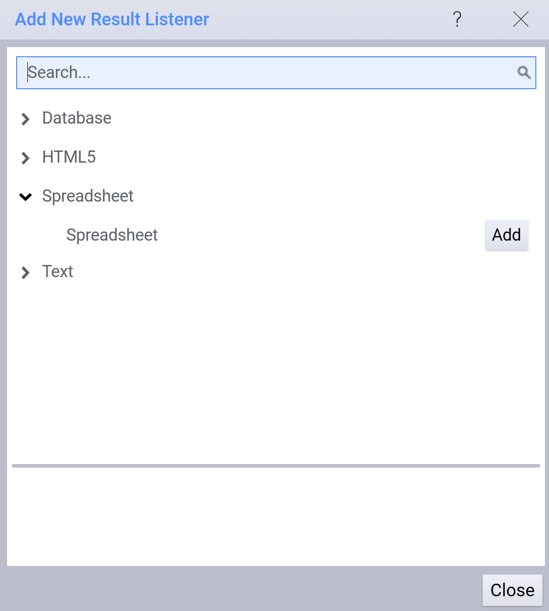
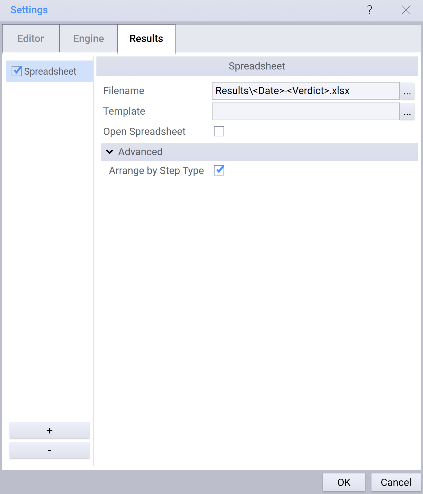
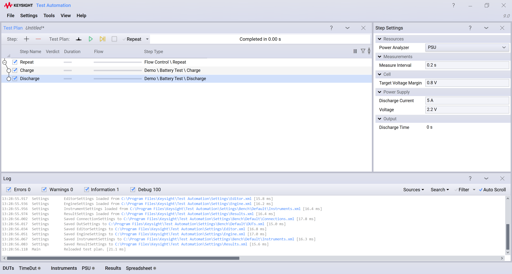
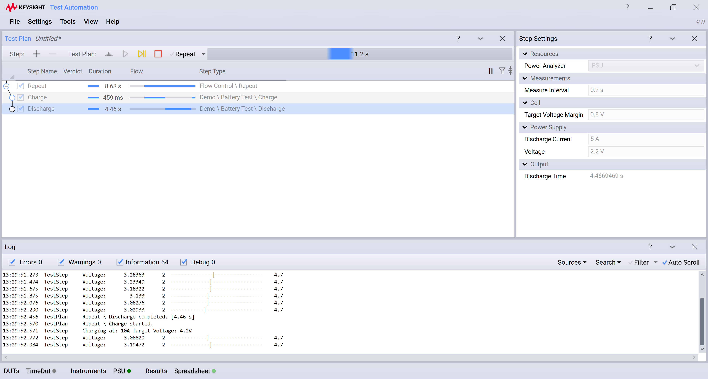
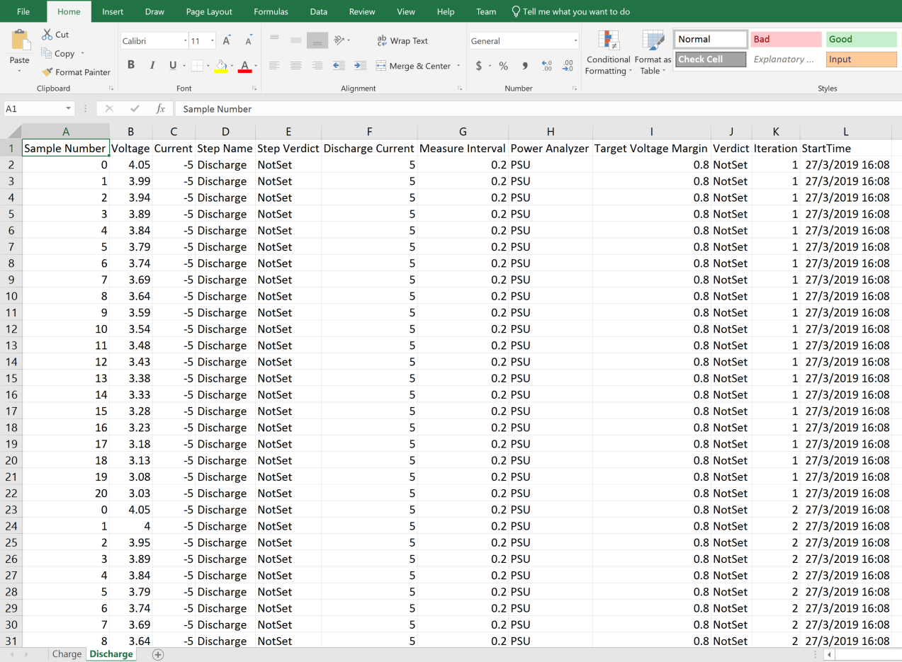
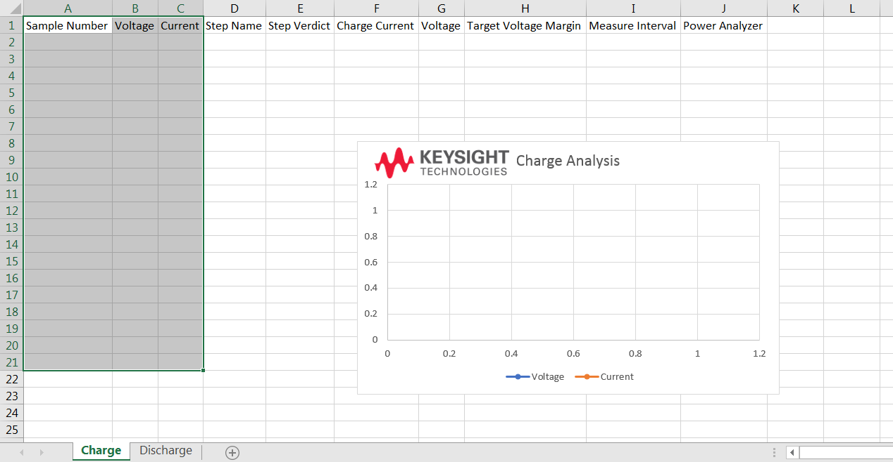
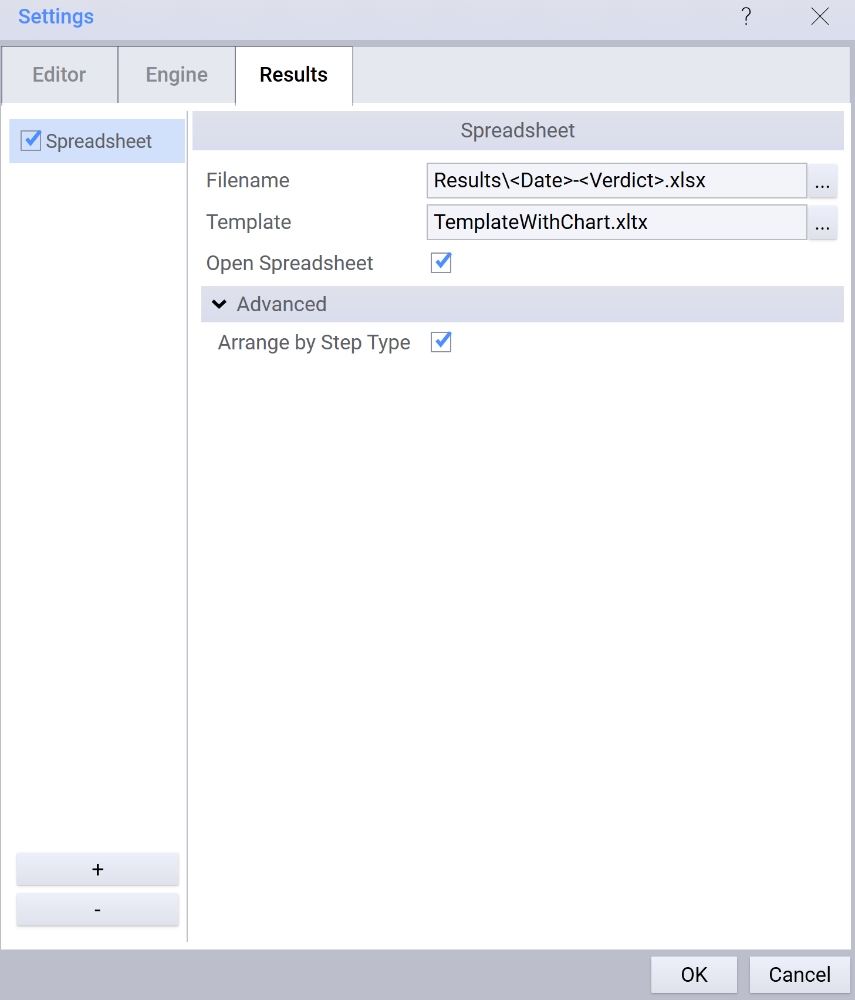
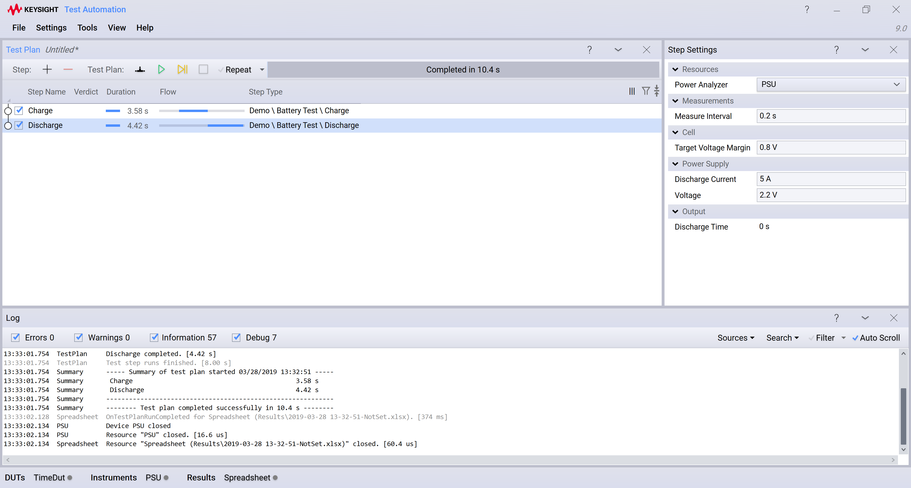
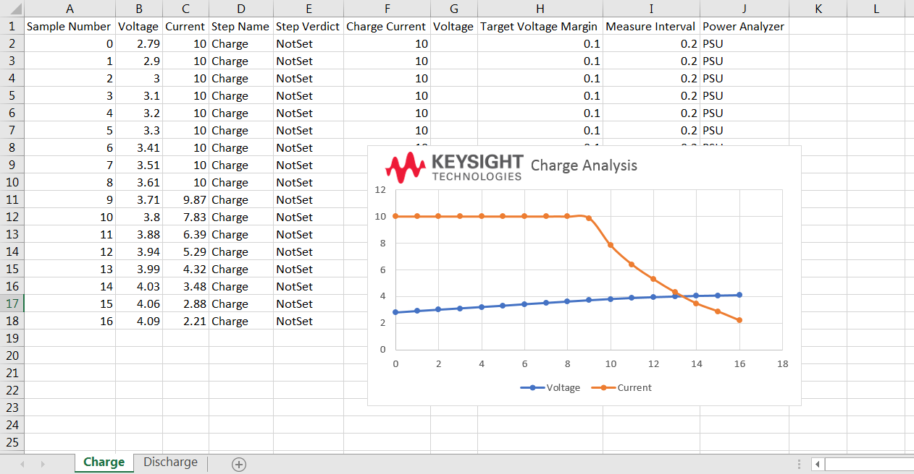

## Keysight Test Automation Spreadsheet Plugin  

## Using the Spreadsheet Plugin

- Start by adding the Spreadsheet ResultListener to Keysight Test Automation

 - Set the FilePath for the output report.
 - Select whether to automatically open default Spreadsheet program such as Microsoft Excel at the end of the Test run
 - Optionally, choose a template file. More details on this are provided in the __Using Templates__ section.
 - 'Arrange by Step Type' option, if enabled, combines the results from the same step types into a single result. Results from the certain type of steps will be placed in the same sheet.

## Usage Example

Here is an example of the usage of this plugin, with the 'Demonstration' plugin:

Add the required test steps to your plan:

Ensure that you have Spreadsheet ResultListener added and configured as explained in the section above. 

Run your Test Plan.

The final results are shown below. Notice that results for each step type appear in different sheets and results for similar step types across multiple iterations are collected in the same sheet. If you would like each step result to be placed in a separate sheet, disable the 'Arrange by Step Type' option.

## Using Templates

This plugin also supports templates (xltx, xlsx files) to customize the output report by adding logos, graphs, summary sheets, etc. The process for creating and using templates is the same as that in Microsoft Excel or any other spreadsheet application. The original template file is always preserved and the customizations set in the template appear in the output report.

A simple example of template usage is provided below:

- A good place to start is to pick up an existing report, customize it and then use it as a template.
- In this example, we have used a template based on a report generated by using the simulated demonstration charge and discharge steps.
- Add a chart that plots the first three columns of the report. This represents the Sample Number, Voltage and Current values columns.
- We can also insert a logo on top of the chart.

- In the ResultListener settings, specify the path of the template:

- Now, create a TestPlan with Charge and Discharge simulation example steps:

- Run the TestPlan and review the generated report. Notice that the output report shows the customizations done in the input template:

You can use .xlsx files as templates as well. The original file will still be preserved when a report is generated.
